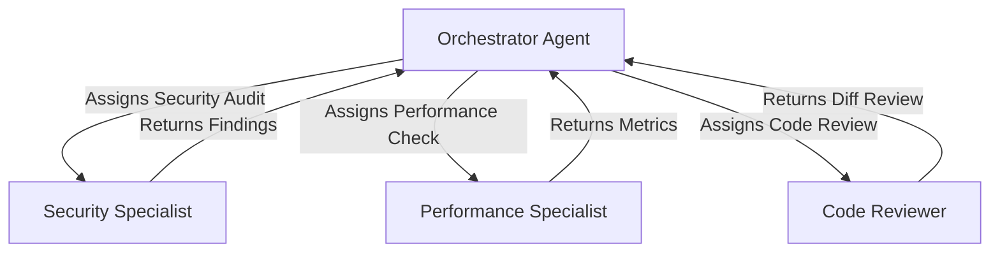
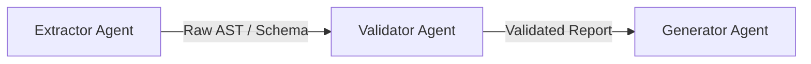
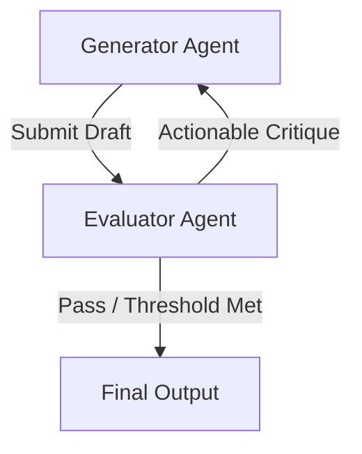
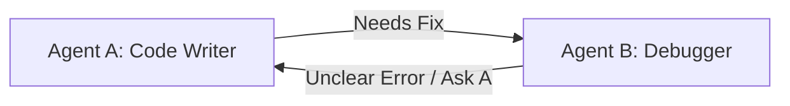

# Multi-Agent Delegation Patterns & Architecture Guide

This reference document outlines valid versus invalid multi-agent design patterns, provides architectural examples, and establishes evaluation criteria for auditing multi-agent delegation frameworks.

---

## 1. Single Responsibility Principle (SRP) for Agents

In a multi-agent system, each agent must have a distinct, non-overlapping responsibility. Combining unrelated tasks into a single agent causes instruction bloat, degrades model reasoning, and increases hallucination rates.

### Key Criteria for Agent Separation:
- **Domain Boundaries**: Does this agent require specialized system prompts, distinct tool sets, or different domain context than other agents?
- **Cognitive Load**: Is the task complex enough to justify a dedicated context window?
- **Model Specialization**: Does this task benefit from a different model class (e.g., fast/cheap model for data extraction vs. high-reasoning model for architecture review)?

---

## 2. Valid Multi-Agent Delegation Patterns

### Pattern A: Hub-and-Spoke (Orchestrator-Specialist)
A central orchestrator breaks down a high-level goal, delegates specific sub-tasks to specialized domain agents, and synthesizes their outputs into a final result.

- **Characteristics**: Directional flow, clear input contracts, centralized synthesis.
- **Validity**: ✅ **VALID**. Excellent for parallel execution and complex multi-domain workflows.

### Pattern B: Sequential Pipeline
Task execution flows linearly through a series of specialized agents where each agent transforms the data and passes structured output to the next stage.

- **Characteristics**: Each stage has strict input/output contracts. No upstream back-tracking.
- **Validity**: ✅ **VALID**. Optimal for multi-stage compilation, ETL pipelines, or sequential refinement.

### Pattern C: Evaluator-Optimizer Loop
A generator agent produces an artifact or code draft, which is passed to a distinct evaluator agent. The evaluator scores the draft against a rubric and returns actionable critique until quality thresholds are met or maximum iterations expire.

- **Characteristics**: Controlled iteration loop with bounded retries (`MaxIterations`).
- **Validity**: ✅ **VALID**. Ensures high quality output through adversarial or rubric-based checking.

---

## 3. Invalid and Pathological Delegation Patterns

### Pattern X: Circular Hand-offs (Deadlock / Ping-Pong)
Two or more agents delegate tasks back and forth without clear termination criteria or hierarchical boundaries.

- **Violation**: Circular delegation without directional hierarchy.
- **Ruling**: 🚨 **FAIL**. High risk of infinite loops, token exhaustion, and deadlock.
- **Fix**: Redesign as an Orchestrator-Specialist or bounded Evaluator-Optimizer loop.

### Pattern Y: Duplicate / Overlapping Responsibilities
Two agents in the same ecosystem claim identical or heavily overlapping roles (e.g., both `CodeAuditor` and `SecurityReviewer` running full general static analysis).

- **Violation**: Responsibility collision and redundant token consumption.
- **Ruling**: 🚨 **FAIL** (if identical) or ⚠️ **WARN** (if poorly demarcated).
- **Fix**: Merge agents or clearly define mutually exclusive operational boundaries.

### Pattern Z: Blind Delegation (Orphaned Execution)
An agent delegates a complex task to a subagent without providing required context, file paths, or structured input parameters, and without specifying what output format is expected upon return.

- **Violation**: Missing Agent Development Lifecycle (ADLC) input/output contracts.
- **Ruling**: 🚨 **FAIL**. Subagent will hallucinate context or fail execution.
- **Fix**: Define explicit input payloads and structured return schema.

---

## 4. ADLC Evidence Checklist

When reviewing multi-agent skills, verify that the architecture documentation demonstratesAgent Development Lifecycle (ADLC) maturity:

1. **Problem Statement**: Explicit definition of why multiple agents are required over a single prompt.
2. **Input/Output Contracts**: Clean definition of what parameters enter each agent and what structured data exits.
3. **Failure Mode Handling**: Clear fallback mechanisms when a subagent fails, times out, or returns invalid schema.
4. **Success Criteria**: Quantitative or qualitative metrics defining successful task completion.
